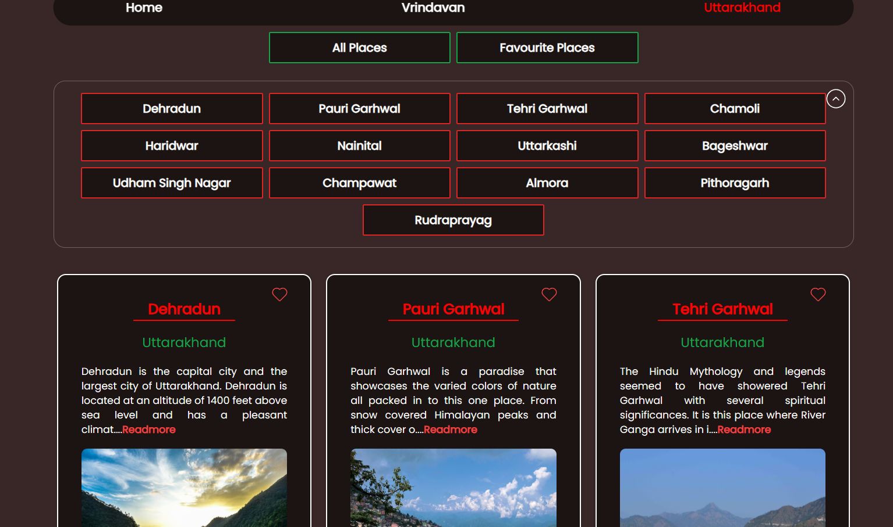

# 🇮🇳 Incredible India Tourism Web App

A visually engaging and informative tourism web application showcasing the spiritual richness of **Vrindavan** and the natural beauty of **Uttarakhand**. This project allows users to explore various famous places, view detailed descriptions, mark favorites, and enjoy an interactive browsing experience.

---

## 🧭 Features

- 🛕 **Temples of Vrindavan**:
  - Shri Bankey Bihari Mandir
  - Shri Radha Vallabh Mandir
  - Shri Radha Raman Mandir
  - Nidhivan, Prem Mandir, and more

- 🏔️ **Destinations in Uttarakhand**:
  - Dehradun, Tehri Garhwal, Pauri Garhwal, Nainital, Chamoli, etc.

- ❤️ **Favorite Functionality**:
  - Mark places you love with a heart icon
  - View your selected favorite locations easily

- 🃏 **Card-Based UI**:
  - Each place is displayed as a responsive card with an image, short description, and "Read More" option
  - Option to scroll through more images within cards

- 🌗 **Dark Theme Styling** using Tailwind CSS for a modern, elegant look

---

## 🛠️ Tech Stack

- **Frontend**: React.js
- **Styling**: Tailwind CSS
- **Routing**: React Router (if implemented)
- **State Management**: React useState (for favorites)
- **Image Assets**: Stored in `public/` or local components

---

## 📁 Folder Structure

```
starter/
├── public/
├── src/
│   ├── Components/         # Reusable components like Cards, Headers, etc.
│   ├── Pages/              # Main pages for Vrindavan, Uttarakhand, etc.
│   ├── Vrindavan_gallery/  # Specific galleries for Vrindavan temples
│   ├── App.js              # Main app component
│   ├── data.js             # Static data of places and descriptions
│   ├── index.js            # React entry point
│   ├── index.css           # Tailwind directives and global styles
│   ├── vr.jpg              # Static image asset
├── .gitignore
├── package.json
├── tailwind.config.js
├── postcss.config.js
├── README.md
```

---

## 🚀 Getting Started

### Prerequisites

- Node.js installed
- npm or yarn

### Installation

```bash
git clone https://github.com/your-username/india-tourism-app.git
cd india-tourism-app
npm install
```

### Run Locally

```bash
npm run dev
```

or

```bash
npm start
```

---

## 🖼️ Screenshots

### Vrindavan Temples


### Uttarakhand Places


---

## 🌟 Future Enhancements

- Add more regions like Himachal, Rajasthan, etc.
- Implement user authentication to save favorites persistently
- Add map views with Google Maps integration
- Add blog or testimonial sections from travelers
- Deploy live via Netlify or Vercel

---

## 🙏 Acknowledgements

- Image credits to respective sources
- Content based on real tourist guides and resources

---

## 📜 License

This project is licensed under the [MIT License](LICENSE).


*Created with ❤️ by [Satyam](https://github.com/Satyam-nitp).*